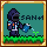

[English] [[日本語]](README_JP.md) [[中文]](README_ZH.md)

{: align="center"}

# Hello, Doctor!
This Mod for Terraria is made for Arknights Doctor. I'm creating the Mod based on the idea of Arknights, adding my own interpretation. 
Have a good life of Arknights in Terraria, Doctor!

## What is Terraria?
Terraria is a land of adventure! A land of mystery! A land that's yours to shape, defend, and enjoy. Your options in Terraria are limitless. Are you an action gamer with an itchy trigger finger? A master builder? A collector? An explorer? There's something for everyone. 
Start by building basic shelter, then dig for ore and other resources. Discover and craft over 500 weapons of magic, ranged, melee and summon varieties, as well as armor, and use them to battle hundreds of different enemies. Soon you'll be going head-to-head with any of a dozen enormous bosses. Go fishing, ride a mount, find Floating Islands, build houses for helpful NPCs, and much, much more.
- [Terraria](https://www.terraria.org)
- [Official Terraria Wiki](https://terraria.fandom.com/wiki/Terraria_Wiki)

## What is Arknights?
Arknights is a mobile tower defense (TD) game developed by Hypergryph.  I think you Terraria lovers will love it!

## What can you do with the Mod?
You can play it as Arknights Doctor, and can use many items associated with many Operators.

## How to play?
First, please purchase [the Desktop version (Steam) of Terraria](https://store.steampowered.com/app/105600/), and download [tModLoader](https://store.steampowered.com/app/1281930/tModLoader/) (which is free). tModLoader will automatically launch Terraria and allow you to install mods.
Once it is up and running, select Workshop from the menu and open the Mod Browser. Then, search for Arknights Mod. Or download it directly from the Terraria forum (link) and place the file in `%userprofile%/Documents/My Games/Terraria/ModLoader/Mods/` for Windows or in`~/Library/Application support/Terraria/tModLoader/Mods` for Mac.

## Contributing
Recruitment tag: [Program][Sprite][Terraria][Discussion][Audience] 
As long as you are interested in one of them, please join our Discord server (below) and tell us about it. 
🐰"There's still lots of work that needs to be done, Doctor. We can't afford to have you resting." 
There is a lot of work to be done in Terraria. We look forward to welcoming you and your doctors to join us.

## Disclaimer
- Please note that this mod are released under the [TERMS AND CONDITIONS OF RE-CREATION](https://www.arknights.global/fankit/guidelines).
- I do not take any responsibility or liability for any damage or loss caused through this mod. (So, you should [back up the game data](https://github.com/tModLoader/tModLoader/wiki/Basic-tModLoader-Usage-Guide#world-and-player-backups) periodically.)
- You are NOT allowed to use or to reproduce the code and the images of this mod.
- If you have any questions regarding the use of this mod, please contact our Discord server (below).

## Contact
hoge
